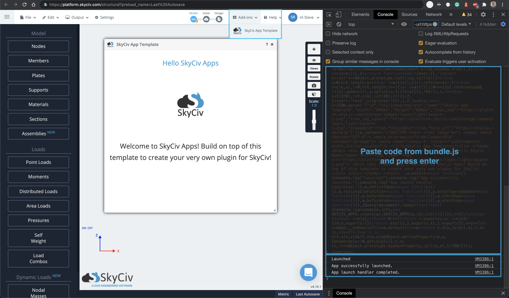

# SkyCiv App Template

## What Is This?

This is a template project to create a SkyCiv app for S3D.

----

## Getting Started

1. To get started, clone this repo and remove the existing git files.

```zsh
git clone https://github.com/skyciv/sc-app-template.git

# Change directory into the project
cd sc-app-template

# Remove existing git file and reinitialize.
rm -rf .git
git init

# Install dependencies
npm i
```

2. Rename the project folder to something suitable.

3. Open the project in a code editor and edit the `app.config.json` file. You can also import your functions into `events.config.js` and place them inside any events triggered by S3D. See the example inside the `onInit()` function - it calls the function `onAppLaunch()`.

4. Edit `public/index.html` and `src/styles.css` as required. Avoid editing `index.js` unless you are an experienced developer.

5. Start coding inside `app.js`. Some template folders have been created to help organise your code: `handlers`, `lib`, `scripts`, `utils`.

To make your functions available across files, use `import` syntax

Example:

app.js
```js
export function onAppLaunch() {}
```

Now we can import this function in another file and webpack will handle the rest with the `npm run build` command

anotherFile.js
```
import {onAppLaunch} from './'
```

----

## Compile
Run the following command to build your project.

```npm run build```

This will create `dist/bundle.js`. Copy the code inside this file and past it into the browser console on [SkyCiv Structural 3D]('https://platform.skyciv.com/structural').

The app will then be available in the drop down menu.



----

## Config Variables

```json
{
	"id": "skycivAppTemplate", // string - File name of your model.
	"name": "SkyCiv App Template", // string - Path in your cloud file storage.
	"content": "<p>SkyCiv Apps</p>", // string - HTML string of what should be displayed in the app.
	"width": "600px", // string - Optional width setting for app window.
	"height": "600px", // string - Optional height setting for app window.
	"icon_img": "https://platform.skyciv.com/storage/images/logos/light/square-1.png", // string - URL of image to be used.
	"icon_img_square": "https://platform.skyciv.com/storage/images/logos/light/square-1.png", // string - URL of image to be used within the app header.
	"draggable": true, // bool - Is the app window draggable. True by default.
	"resizable": true, // bool - Can user resize window? Used alongside resizeableFunction to update.
	"help_url": "https://skyciv.com/help" // string - URL of documentation or help page.
}
```
----

## Config Events

```json
{
	"onInit": "", // function - Function which runs when the page loads the app.
	"resizeableFunction": "", // function - Function which runs when the app window is resized.
	"onFirstOpen": "", // function - Runs when the app is open for the first time.
	"onSoftwareUpdate": "", // function - Function to run after changes are made to your model in S3D. E.g. Bill of Materials App re-calculates cost when a member is added/deleted.
	"beforeShow": "", // function - Before the app is shown, run this function.
	"aferShow": "", // function - After the app is shown, run this function.
	"beforeHide": "", // function - Before the app is hidden, run this function.
	"aferHide": "" // function - After the app is hidden, run this function.
}
```
